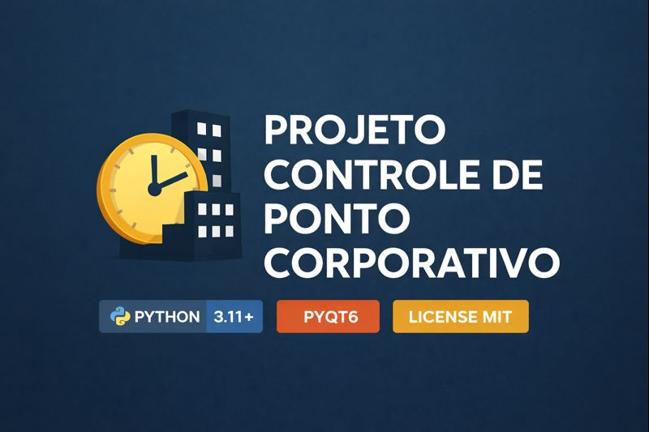
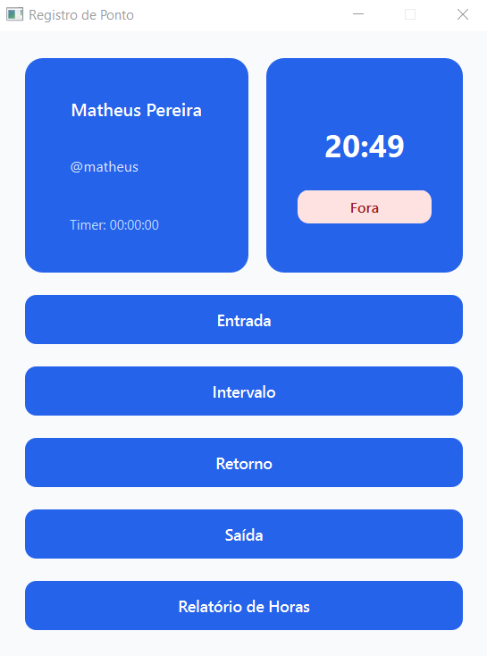
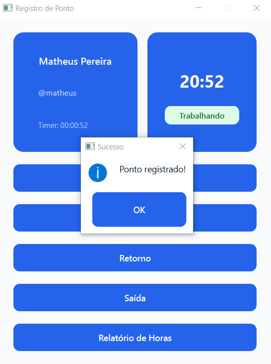
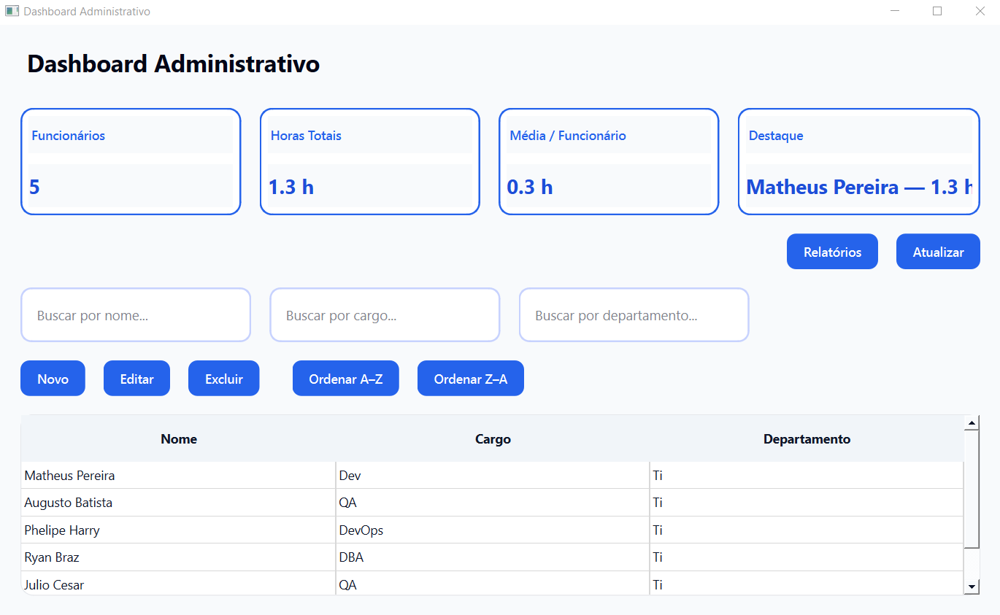
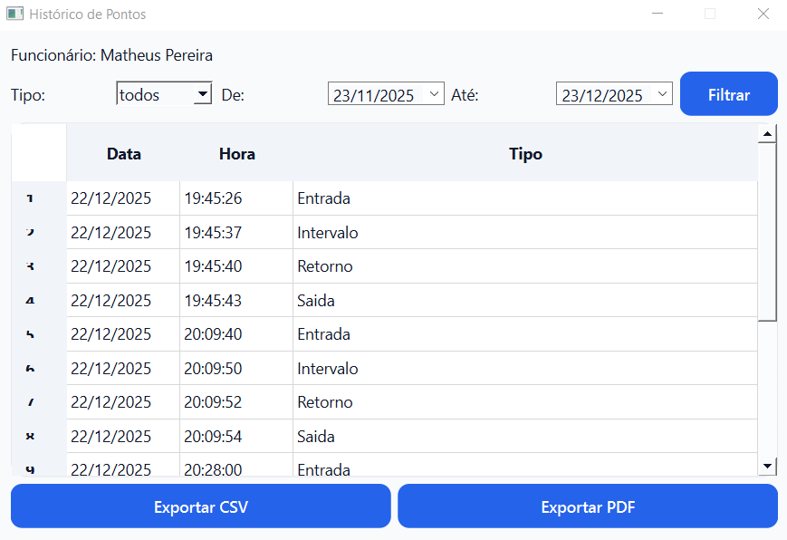

<p align="center">
  
</p>

<h1 align="center">⏱️ CONTROLE DE PONTO CORPORATIVO</h1>

<p align="center">
  
</p>

<p align="center">
  
  
  
  
</p>

---

# ⚠️ Aviso
**Status do Projeto:** Em desenvolvimento.

Sistema desktop desenvolvido em **Python + PyQt6** para **Controle de Ponto Corporativo**, com foco em organização, usabilidade e gestão de jornada de trabalho.

---

# 🧩 Visão Geral

O **Controle de Ponto Corporativo** permite que empresas realizem:

- Registro de jornada de trabalho
- Controle de intervalos
- Cálculo automático de horas
- Gestão de funcionários
- Relatórios administrativos

A aplicação é dividida em dois módulos principais:

- 👤 **Funcionário**
- 🛠️ **Administrador**

---

# ✅ Funcionalidades

## 👤 Painel do Funcionário

- Registro de **Entrada**
- Registro de **Intervalo**
- Registro de **Retorno**
- Registro de **Saída**
- Exibição do **status atual**
- Relatório individual de horas

## 🛠️ Painel Administrativo
- Cadastro de funcionários
- Edição de nome, cargo e departamento
- Exclusão de funcionários
- Busca por nome, cargo e departamento
- Ordenação A–Z / Z–A
- Dashboard com métricas gerais
- Geração de relatórios

---

# 🖼️ Capturas de Tela

## 🔐 Tela de Login
<p align="center">
  
</p>

---

## 👤 Dashboard do Funcionário
<p align="center">
  
</p>

---

## ⏱️ Registro de Ponto
<p align="center">
  
</p>

---

## 📊 Relatório de Horas do Funcionário
<p align="center">
  
</p>

---

## 🛠️ Dashboard Administrativo
<p align="center">
  
</p>

---

## ➕ Cadastro de Funcionário
<p align="center">
  
</p>

---

## 🚀 Histórico de Pontos
<p align="center">
  
</p>

---

## 📈 Gráfico de Funcionário
<p align="center">
  
</p>

---

# 🛠️ Tecnologias Utilizadas

| Categoria  | Tecnologia  |
|--------------------------|
| Linguagem | Python 3.11+ |
| GUI | PyQt6 |
| Armazenamento | JSON |
| Arquitetura | MVC |
| Versionamento | Git & GitHub |

---

# 🚀 Como Executar o Projeto

## 1️⃣ Clonar o repositório
```bash
git https://github.com/MatheusPereiira/staff-time-tracking.git
cd staff-time-tracking
```
## 2️⃣ Crie um ambiente virtual
```bash
python -m venv venv
```

## ▶️ Ativar o ambiente virtual
```bash
Windows:
.\venv\Scripts\activate
```
## Linux/macOS:
```bash
source venv/bin/activate
```
## 3️⃣ Instale as dependências
```bash
pip install -r requirements.txt
```
## 4️⃣ Execute o programa
```bash
python main.py
```
---

## 📂 Estrutura do Projeto
```bash
staff-time-tracking/
├── assets/              # Estilos QSS
├── controllers/         # Regras de negócio
├── data/                # Dados em JSON
├── images/              # Banner e logo
├── models/              # Modelos
├── screenshot/          # Capturas de tela
├── utils/               # Utilitários
├── views/               # Telas PyQt6
├── main.py              # Arquivo principal
├── requirements.txt
└── README.md
```
---
## 📄 Licença
Este projeto está sob a **MIT License**, permitindo uso livre para estudo, modificação e distribuição.

---

## 👤 Autor
**Matheus Pereira** <br> 
🎓 Estudante de Engenharia de Software Faculdade de Nova Serrana <br>
💻 Python | PyQt | Sistemas Desktop <br>
🔗 GitHub: https://github.com/MatheusPereiira

---